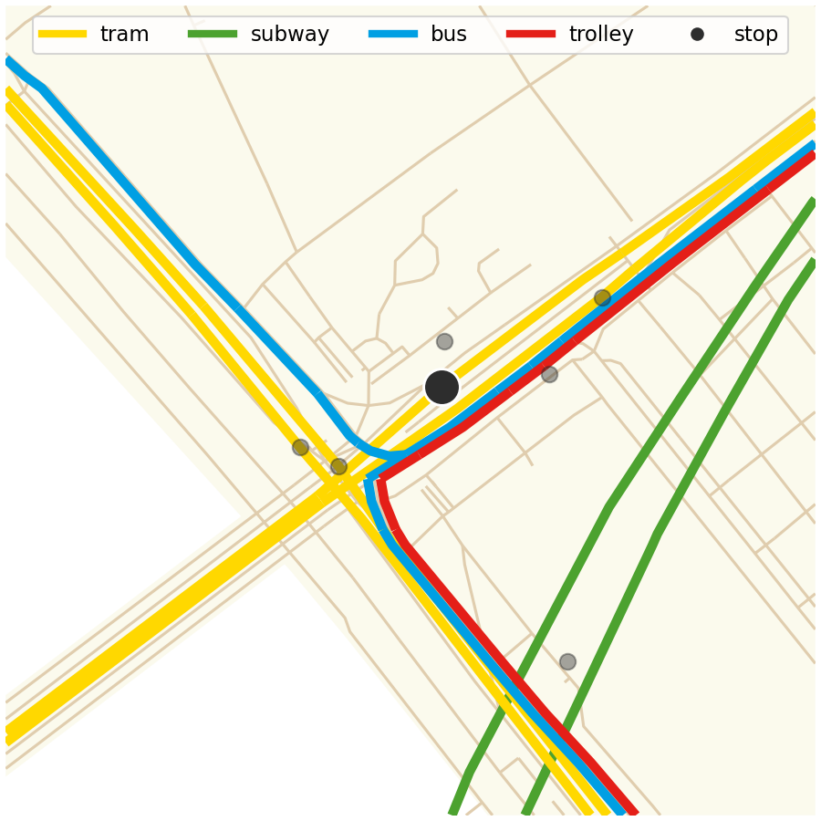

# stop accessibility

## requirements

To calculate the accessibility isochrones this code uses the [Valhalla](https://github.com/valhalla/valhalla) routing engine via [pyvalhalla](https://github.com/gis-ops/pyvalhalla).
As pyvalhalla is no longer developed, it cannot work with Python newer with 3.11.

To install an older Python version, `pyenv` was used.

```
pyenv install 3.11.11
```

The dependencies are managed with [poetry](https://python-poetry.org/).

```
poetry lock && poetry install
```

## OSM source

Geofabrik, with the smallest possible unit:

- [Budapest](https://download.geofabrik.de/europe/hungary.html)
- [Helsinki](https://download.geofabrik.de/europe/finland.html)
- [Madrid](https://download.geofabrik.de/europe/spain/madrid.html)
- [Paris](https://download.geofabrik.de/europe/france/ile-de-france.html)
- [Rotterdam](https://download.geofabrik.de/europe/netherlands/zuid-holland.html)

## accessibility area output schema

- geometries are in EPSG:4326 projection
- costing denotes whether the area is calculated by walking (walk) or biking (bicycle)
- range is in minute
- the isochrones are also available in GeoJSON format

|   stop_id | geometry                                                    | costing |   range |
|----------:|:------------------------------------------------------------|:--------|--------:|
|    008951 | POLYGON ((19.218675 47.433216, [...], 19.218675 47.433216)) | walk    |       5 |
|    008951 | POLYGON ((19.220675 47.436717, [...], 19.220675 47.436717)) | walk    |      10 |
|    008951 | POLYGON ((19.220675 47.43934,  [...], 19.220675 47.43934))  | walk    |      15 |
|    008951 | POLYGON ((19.217675 47.440074, [...], 19.217675 47.440074)) | bicycle |       5 |
|    008951 | POLYGON ((19.215675 47.449231, [...], 19.215675 47.449231)) | bicycle |      10 |
|    008951 | POLYGON ((19.210675 47.456055, [...], 19.210675 47.456055)) | bicycle |      15 |

NB: geometries are shortened in the sample above, consequently not valid


## get city boundaries

```
ruby filter.rb --city budapest --name Budapest --pbf hungary-20250123.osm.pbf --delete-intermediate
ruby filter.rb --city madrid --name Madrid --pbf madrid-latest.osm.pbf --delete-intermediate
ruby filter.rb --city rotterdam --name Rotterdam --pbf zuid-holland-latest.osm.pbf --delete-intermediate
ruby filter.rb --city paris --name Paris --pbf ile-de-france-latest.osm.pbf --delete-intermediate
ruby filter.rb --city helsinki --name Helsinki --pbf finland-latest.osm.pbf --delete-intermediate
```

## calculate stop distance from the city center

- distance is simply the Euclidean distance in a meter based projection
    - the projections are stored in the [`data/crs.yaml`](data/crs.yaml)

The city center can be defined multiple ways.
The centroid of the city geometry can be considered as the center, but could raise problems if the city shape in concave (e.g., Rotterdam).
Not aiming for a universal solution, the centroid of the residential areas (filtering from OSM by the [landuse key](https://wiki.openstreetmap.org/wiki/Key:landuse)) could solve the problem, at least in the case of Rotterdam, because the western part is industrial area only.

Another option is to use the [GTFS](https://en.wikipedia.org/wiki/GTFS) networks and select the largest [betweenness centrality](https://en.wikipedia.org/wiki/Betweenness_centrality).
However, as the network uses a clustering, the centrality value will be the same for multiple stops (of a cluster), which provides multiple stop instead of a single point.

There are two possible ways to determine the center of the cluster, representing the city center: using the centroid (left) or the medoid (right) of the cluster points.
Centroid defines a new, "virtual" stop, while medoid is an existing stop.
In the example below the difference is marginal, a couple of meters only, so it has no significant effect to the outcome.
Still, both of them is provided.




 <!-- <figure>
    
    <figcaption>centroid</figcaption>
</figure>
 <figure>
    
    <figcaption>medoid</figcaption>
</figure> -->

## Ellipticity

Ellipticity is an indicator describing the shape of a polygon.
Its domain is between 0 and 1, the larger the value is the shape of the polygon is more elongated.

First example is Fővám square (blue), its ellipticity is low (0.06), whereas the 509th street (red) is much more elongated, its ellipticity is high (0.61).


Ellipticity is defined as follows.
$$ellipticity = 1.0 - (minor\_axis\_length / major\_axis\_length)$$


## Accessibility polygons

The stops are extracted from the GTFS (and clustered as described above).
From each point, a 5-minute walking accessibility area is generated by Valhalla.
The 15-minute walking area is also calculated.

Using the timetable in the GTFS data, stops that are available from a given stop by 10-minute public transport are determined.
The multimodal (currently 5-minute walk + 10-minute public transport) accessibility area is defined as the union of every 5-minute stop walking area of those stops that are available within a 10-minute public transport trip.
See the example below.


### amenity count

The amenities, extracted from OpenStreetMap, which are within the accessibility ranges (either 15-minute walk oe multimodal) are counted.

The amenities are aggregated to higher-level [categories](data/essential_amenities.yaml).

## workflow

```yaml
- name: extract_accessible_stops.ipynb
  input:
    - 10_minute_walbetclus.pkl
  output:
    - accessible_stops.json
- name: calculate_accessibility.ipynb
  input:
    - valhalla_tiles.tar
    - stops_with_centrality.csv
  output:
    - isochrones.csv
- name: determine_stop_polygons.ipynb
  input:
    - crs.yaml
    - isochrones.csv
    - accessible_stops.json
    - stops_with_centrality.csv
  output:
    - stop_geometries_from_walk.csv
    - stop_geometries_from_walk.geojson
- name: count_amenities_in_accessibility_polygons.ipynb
  input:
    - essential_amenities.yaml
    - amenities_filtered.wkt.csv
    - stop_geometries_from_walk.geojson
  output:
    - amenity_counts_in_accessibility.csv
    - amenity_counts_in_public_transport_accessibility.csv
- name: determine_distance_from_center.ipynb
  input:
    - stops_with_centrality.csv
  output:
    - distance.csv
- name: merge_indicators.ipynb
  input:
    - distance.csv
    - amenity_counts_in_accessibility.csv
    - amenity_counts_in_public_transport_accessibility.csv
    - stop_geometries_from_walk.csv
    - stops_with_centrality.csv
  output:
    - merged.csv

```

The `pipeline.rb` Ruby script can execute every script for a given city.

### outer sources

- accessible_stops.json
  - this one is based on Maté Mizsák's work, which has two outputs:
    - stops_with_centralities.csv
    - 10_minute_walbetclus.pkl
      - this one is a [pickled](https://docs.python.org/3/library/pickle.html) Python object with the following structure: `dict[str, tuple[list, set[str]]]`
      - the dictionary key is a stop ID, the first element of the tuple is a list of routes accessible within 10 minutes (with the exact time required), and the set is a set of stop IDs accessible from the the given stop.
      - the `data/stops/<CITY>/accessible_stops.json` is an extracted form of the set from the `10_minute_walbetclus.pkl`, with the structure of `dict[str, list[str]]]`
- [CRS](https://en.wikipedia.org/wiki/Spatial_reference_system), with meter as unit used, for the distance calculations. For each city/country a specific ones should be used, these are read from the [data/crs.yaml](data/crs.yaml) file.
  - for Hungary it is the [Egységes Országos Vetület](https://hu.wikipedia.org/wiki/Egys%C3%A9ges_orsz%C3%A1gos_vet%C3%BClet), also known as [EPSG:23700](https://epsg.io/23700)
  - if needed, you can change it, by modifying the values for every city
- Valhalla tiles in `data/valhalla/<CITY>/valhalla_tiles.tar`
  - for calculating the accessibility areas (`output/<CITY>/isochrones.geojson`), the [isochrone API](https://valhalla.github.io/valhalla/api/isochrone/api-reference/) of the [Valhalla routing engine](https://github.com/valhalla/valhalla) is used.
  - Valhalla uses OpenStreetMap data to prepare a network used for routing. Although it can be used as a server-client application, for projects like this, it is more convient to extract the precompiled network (vallhalla_tiles.tar) and use valhalla from a [python package](https://github.com/gis-ops/pyvalhalla).
  - further info in [this repo](https://github.com/ANET-NETI/accessibility)
- [amenity categories](data/essential_amenities.yaml)
  - based on the paper [The 15-minute city quantified using human mobility data](https://www.nature.com/articles/s41562-023-01770-y)
  - more discussion is here: https://github.com/ANET-NETI/15minute_city/issues/18

## Caveats

<!-- As this code uses a precompiled Valhalla network from an old, 2023 September OSM snapshot. -->
- The Budapest isochrones are calculated with an old, 2023 September OSM snapshot.
- [pyvalhalla](https://github.com/gis-ops/pyvalhalla) in unmaintained in its current form and not compatible with Python 3.12+, so this code requires a special environment with Python 3.11